### Andersson David Sánchez Méndez
# stock-products
This is the first CVDS exam, applying knowledges about Maven, Java, JaCoco, SonarCloud

# PARCIAL PRIMER CORTE - SOLID, PATRONES, TDD, SPRING

## PRE-RREQUISITOS
- Java JDK Runtime Environment: 17.x.x
- Apache Maven: 3.9.x
- JUnit: 5.x.x

# CONFIGURACIÓN DEL REPOSITORIO 
Como primera medida se configura el repo, en este caso con el nombre de stock-products.

# CREACIÓN DE PROYECTO MAVEN
Usando spring initializr se crea el proyecto


En este caso, el proyecto maven se creó con la versión 21 porque es la que tiene instalada la máquina


# VISTA DEL PROYECTO
Después de generar el proyecto, se sincroniza con el repo de git, simplemente con un git clone y luego se copia y se pega la estructura que se generó en spring, en la carpeta cuando se clona el repo.


# CONFIGURACIÓN DE SONARQUBE, JACOCO, JUNIT en el pom.xml

## Sonarqube
Se agrega esto en properties

```xml
<properties>
		<java.version>23</java.version>
		<project.build.sourceEncoding>UTF-8</project.build.sourceEncoding>
		<maven.compiler.release>17</maven.compiler.release>
		<maven.compiler.target>1.17</maven.compiler.target>
		<maven.compiler.source>1.17</maven.compiler.source>
		<sonar.projectKey>stock-products</sonar.projectKey>
		<sonar.projectName>stock-products</sonar.projectName> 
		<sonar.host.url>http://localhost:9000</sonar.host.url>
		<sonar.coverage.jacoco.xmlReportPaths>target/site/jacoco/jacoco.xml</sonar.coverage.jacoco.xmlReportPaths>
		<sonar.coverage.exclusions>src//configurators/*</sonar.coverage.exclusions>
	</properties> 
```


## JUNIT
Se agrega esto dentro de dependencies

```xml
        <dependency>
            <groupId>org.junit.jupiter</groupId>
            <artifactId>junit-jupiter-api</artifactId>
            <version>5.11.4</version>
            <scope>test</scope>
        </dependency> 
```


## JACOCO y SONAR
Se agrega esto dentro de plugins

```xml
      <plugin>
				<groupId>org.jacoco</groupId>
				<artifactId>jacoco-maven-plugin</artifactId>
				<version>0.8.12</version>
				<executions>
				<execution>
					<goals>
					<goal>prepare-agent</goal>
					</goals>
				</execution>
				<execution>
					<id>report</id>
					<phase>test</phase>
					<goals>
					<goal>report</goal>
					</goals>
					<configuration>
					<excludes>
						<exclude>/configurators/</exclude>
					</excludes>
					</configuration>
				</execution>
				<execution>
				<id>jacoco-check</id>
				<goals>
					<goal>check</goal>
				</goals>
				<configuration>
					<rules>
					<rule>
						<element>PACKAGE</element>
						<limits>
							<limit>
							<counter>CLASS</counter>
							<value>COVEREDRATIO</value>
							<minimum>0.85</minimum><!--Porcentaje mínimo de cubrimiento para construir el proyecto-->
							</limit>
						</limits>
						</rule>
					</rules>
					</configuration>
				</execution>
				</executions>
			</plugin>
			<plugin>
				<groupId>org.sonarsource.scanner.maven</groupId>
				<artifactId>sonar-maven-plugin</artifactId>
				<version>4.0.0.4121</version>
			</plugin>
```

## ENUNCIADO
## NECESIDAD DEL CLIENTE
El cliente necesita un sistema de monitoreo de stock de productos, el cual le permita agregar productos nuevos y actualizar la cantidad de productos disponibles. Adicionalmente cada vez que un producto sea actualizado es necesario que se notifique a los dos agentes que serán implementados; Para los agentes es necesario tener en cuenta las siguientes características, el primero deberá escribir en el stdout las unidades disponibles y el segundo agente deberá escribir en el stdout si hay menos de 5 unidades disponibles lo cual generará una alerta. 
## REQUERIMIENTO
### FUNCIONALES
1. **Añadir un producto:** los productos deben tener nombre, precio, cantidad en stock y categoría.
2. **Modificar stock:** Se debe actualizar la cantidad de producto disponible y adicionalmente se debe notificar a los interesados.
    - Notificar el cambio de stock: Los agentes se deben ejecutar según los requerimientos de cada uno, cuando el stock de cualquier producto se vea afectado.
### AGENTES:
##### AGENTE LOG
Este agente debe escribir en stdout cada vez que se modifica el stock de un producto.
Ejemplo:
```bash
 Prodcto: xbox one s -> 10 unidades disponibles
 ```
##### AGENTE ADVERTENCIA
Este agente debe escribir en stdout cada vez que el stock de un producto es menor a 5.
Ejemplo:
```bash
 ALERTA!!! El stock del Prodcto: xbox one s es muy bajo, solo quedan 4 unidades.
 ```
## DESCRIPCIÓN DEL PROYECTO
Se debe crear un repositorio en GitHub el cual debe tener un proyecto maven que funcione con spring-boot, este proyecto deberá darle solución a los requerimientos del cliente y seguir los principios SOLID. Se debe implementar por lo menos un patrón de diseño, usar la inyección de dependencias para instaciar objetos y es necesario Que las pruebas de unidad reflejen el correcto funcionamiento de los agentes.


## DISEÑO
Luego de analizar el caso de uso que hay que implementar, aplicaré el patrón de diseño *Observer* de comportamiento, el cual consiste en crear una interfaz StockAgent la cual tiene un método **notify**, y los dos tipos de agente implementarán esa interfaz, donde cada una implementa **notify** de acuerdo al stdout que especifica este proyecto.

En otras palabras, este patrón permite definir un mecanismo de suscripción para notificar a varios objetos sobre cualquier evento que le suceda al objeto que están observando.

También, este patrón tiene tanto pros como contras.
- Pros: Aplica el principio SOLID (O).Principio de abierto/cerrado, ya que, se crean nuevas clases sin necesidad de cambiar el código de la notificadora o la interfaz.

- Contras: Las clases suscriptoras a la interfaz notifican en un orden aleatorio.

**Referencia** = https://refactoring.guru/es/design-patterns/observer


Se vería algo así:

- Capa modelo
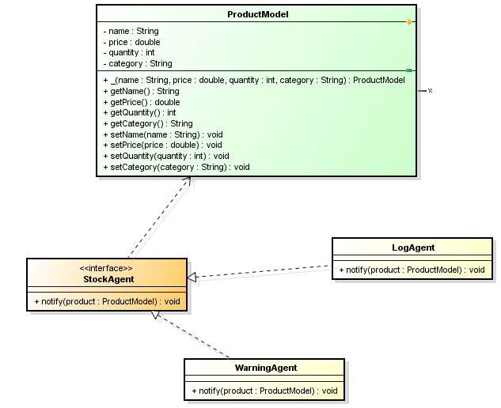

- Capa servicio

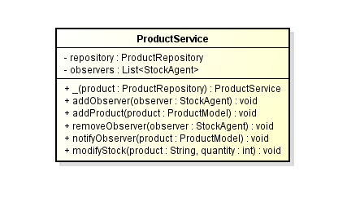

- Capa repositorio

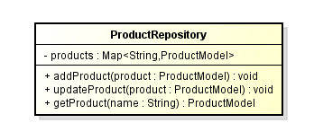


- Capa controlador: En este caso no se usa porque no hay ningún requisito para hacer endpoints o para crear una API Rest en este proyecto, solo se implementa lo más básico.


## TDD 
Luego de tener el diseño estipulado con los atributos y métodos. Ahora, para implementar este caso de negocio, es necesario primero hacer las pruebas para todas las clases, para luego implementar el código para que las pruebas pasen.

Luego de implementar las pruebas, vemos que ninguna sirve por lo que todavía no está implementada la lógica de cada clase o interfaz.

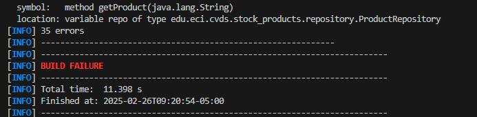


Ahora, sí se hace la implementación necesaria para que las pruebas pasen.

Al momento que le di mvn clean package me marcaron estos errores:
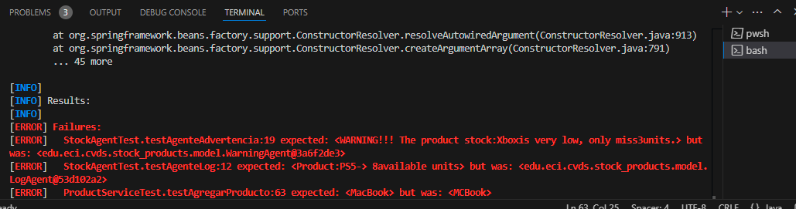
Se solucionaron mirando cada error, y corregirlo en la clase de pruebas correspondiente.

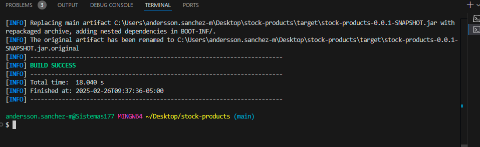

## REPORTE DE JACOCO con JUNIT
Se evidencia la cobertura de pruebas al 89%
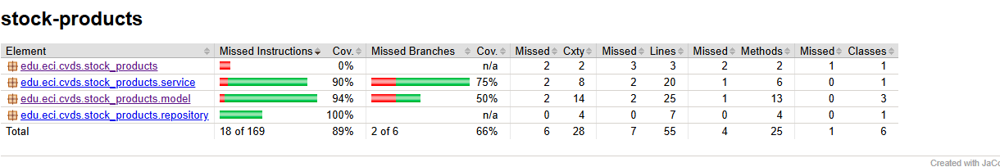
La clase que aparece 0, es la que por defecto crea cuando se genera el proyecto. Por eso no tiene pruebas.

## CONFIGURACIÓN CON SONARCLOUD
Primero, se crea la cuenta en SonarCloud con GitHub, ahora, se crea una organización en Sonarcloud, luego, se genera un token, y con ese TOKEN, se pone este comando en consola para que genere el análisis estático y el reporte de calidad de código.

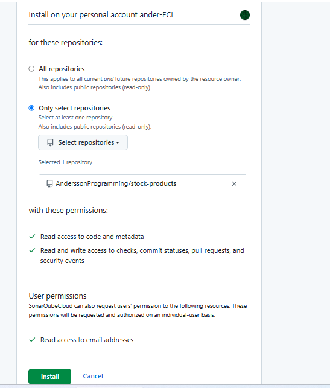

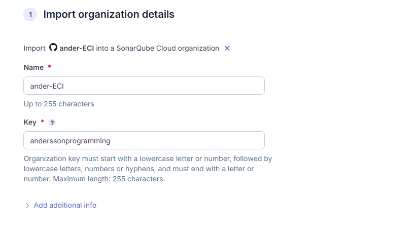
Se le da opción free
Y se analiza el proyecto

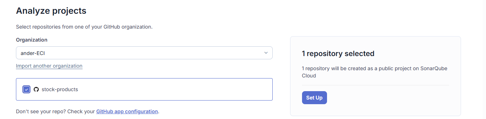 
Se le da en set up

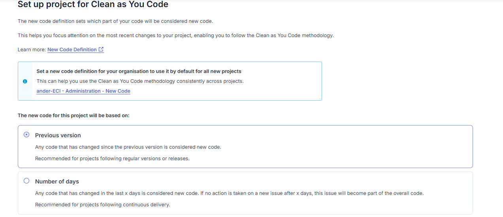

Y create project

Se espera mientras se analiza el código

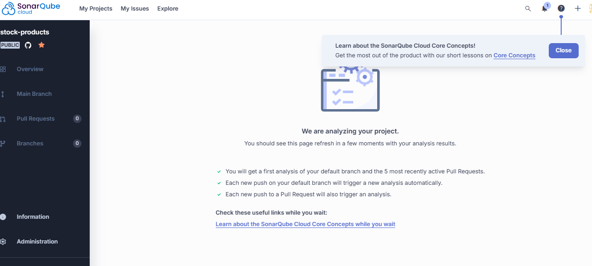

Y se mira el reporte que genera:
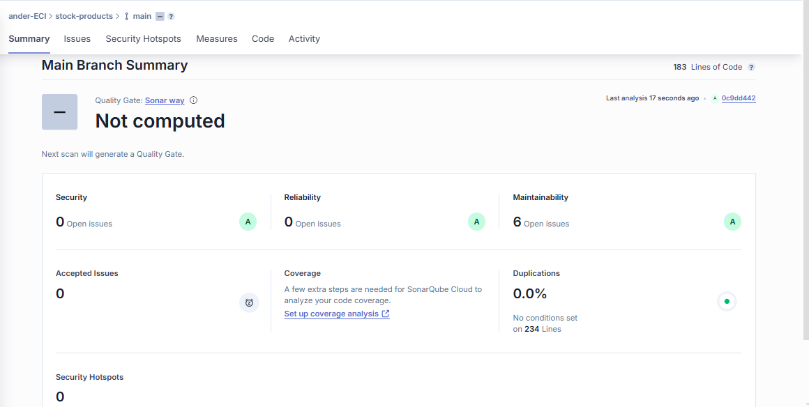


#####  ES IMPORTANTE RECORDAR QUE:

1. El almacenamiento puede ser en estructuras en memoria como Listas, Mapas, etc.

EN ESTE PROYECTO SE USA Map<String,ProductModel> para mapear todos los productos estipulados con su nombre, precio, cantidad y categoría, y también List<StockAgent> para tener como lista todos los agentes de acuerdo a la interfaz.

2. Se debe subir el link del proyecto en el espacio de campus virtual.

HECHO

3. El proyecto debe contar con el diseño documentado en el readme del repositorio y debe terner capturas de pantalla mostrando su funcionamiento.

HECHO

4. EL proyecto debe tener análisis de cobertura con Jacoco mínimo al 80%

HECHO
